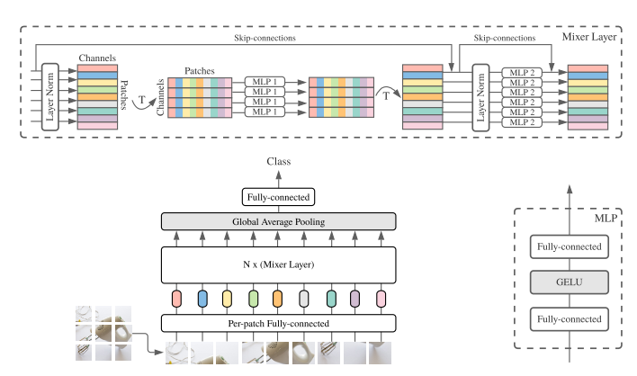

# MLPMixer

## Introduction
MLP Mixers was published in May 2021 by Brain team with the impressive [paper](https://arxiv.org/abs/2105.01601v1).
Their work presented a simple, efficient and speed solution for computer vision and can be a new competitor against CNNs
and transformer in the future. The new architecture contains two type of layers: token mixing and channel mixing. This network
is actually lightweight with the computational complexity is linear comparable with the quadratic approximate in ViT and can work
very well without the position embedding which is a vital element in transformer-based model. In our work, I'll assess this architecture 
for classification task. 

## Architecture


## Citations
```bibtex
@article{tolstikhin2021,
  title={MLP-Mixer: An all-MLP Architecture for Vision},
  author={Tolstikhin, Ilya and Houlsby, Neil and Kolesnikov, Alexander and Beyer, Lucas and Zhai, Xiaohua and Unterthiner, Thomas and Yung, Jessica and Keysers, Daniel and Uszkoreit, Jakob and Lucic, Mario and Dosovitskiy, Alexey},
  journal={arXiv preprint arXiv:2105.01601},
  year={2021}
}
```
